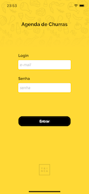
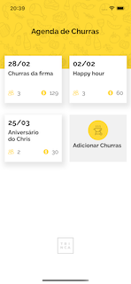
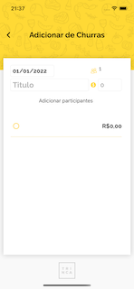

# Churras 🍻
---
Aplicativo criado para marcar um churras de respeito com a galera 🍗


## Sobre o App 📱
- O aplicativo foi construido no padrao MVVM, utilizando Xamarin.Forms.


## Algumas especificações 📝
Para usuários do **VS 2022**, é necessário uma tratativa na IDE para rodar o aplicativo, por conta de um bug conhecido que impede a execução.

Para que o app rode sem problemas, é necessário **desativar o Hot Reload** seguindo estes passos:
 1. Ferramentas 
 2. Opções 
 3. Debugging 
 4. XAML Hot Reload

Link para o bug reportado: [Bug](https://developercommunity.visualstudio.com/t/bug-in-visual-studio-2022-xamarin-signalr-method-n/1528510)


## Pacotes utilizados
- [```Refit (6.1.15)```](https://github.com/reactiveui/refit)
- [```Xamarin.Forms (5.0)```](https://github.com/xamarin/Xamarin.Forms)
- [```Acr.UserDialogs (7.2.0)```](https://github.com/aritchie/userdialogs)
- [```Xamarin CommunityToolkit (1.2.0)```](https://github.com/xamarin/XamarinCommunityToolkit)
- [```PancakeView (2.3.0)```](https://github.com/sthewissen/Xamarin.Forms.PancakeView)

---


## Telas Vertical
|   |  |  |  | 
|:---:|:---:|:---:|:---:|:---:|
| Splash Screen | Tela de Login | Lista de Churras | Adicionar Churras | Lista de Participantes |

## Chamadas API
O aplicativo utiliza o pacote [```Refit```](https://github.com/reactiveui/refit) para chamadas API REST, por possuir uma implementação fácil, código limpo e legível.
Facilita também a criação de testes unitários.
```C#
 [Post("/bbq/auth")]
 Task<TokenResponse> PostUser([Body] object user);
```

## Avisos no app
O pacote [```Acr.UserDialogs```](https://github.com/aritchie/userdialogs) é responsável pela exibição de toasts. Diferente da implementação nativa, ele possui um visual moderno e de fácil estilização.

### Possíveis erros ⚠️
--- A API está retornando valor null para os tipos de dados bool, double e int, quando retornando false, 0.0, e 0, respectivamente.
Por isso, o valor para cada participante de um churras está definido como 1, e a propriedade bool está com atributo nulable (bool?)
 

## Comentários finais. 💬
- O aplicativo é distribuido na versão Android, e iOS.
- O aplicativo pode ser utilizado tanto na vertical como na horizontal.
- A performance da listagem de ordens deve ser testada no modo ```Release```, que é o padrão para este cenário.
- o App deve ser testado em um dispositivo real para testar a performance qualitativamente.

--- 
